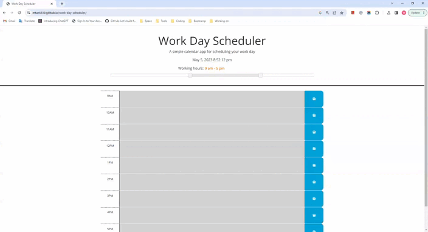

# Work Day Scheduler

## Description

This is a simple daily planner that allows a user to save events for each hour of the day.  

## Usage

* The current date/time is displayed at the top.
* The users can set their own work hours.
* The time blocks are color-coded to indicate past, present, or future, and updated dynamically.
* The users can enter and save events on each time block.
* At the bottom, there are buttons to save or clear all time blocks.
* The saved working hours and events will persist after refreshing the page.

## Links

Page published at https://mtan1230.github.io/work-day-scheduler/

## Demonstration

## Credits  
  Base code developed and provided by Columbia Coding Bootcamp.